# Line Chat Botを作ってみる（基礎編） Wacker #46

---

### 背景 

### Chatって色々可能性があると思う

- NLU(自然言語理解）と音声認識→テキストの組み合わせて、割と口語での入力ができるようになった。
  - まだまだAIが分かるしゃべり方が必要だけど、段々改善されてきている。
  - 文字を打つ手間を解消。
  - ハンズフリーで入力ができる

---

- インプットのI/Fとしてその後ろで色々なサービスと連携できる。
  - 積極的にユーザのオペレーションをガイドできる
    - → 入力ミスを減らせる。ユーザの経験値に頼らなくてもいい。
    - → 学習コストも下げられる = コア業務への学習に時間を割けられる。
  - バックエンドのサービスへのアクセスを隠蔽できる
    - システムやサービスへのアクセス経路を限定できる。

---

- UIに凝らなくていい　＝　UI開発の簡素化
  - 代わりにチャットのシナリオを凝る必要が出てきた。
  - 同じUIなので、異なる機能でもユーザの抵抗感が少ない（かも）

---

### 今日やる事 

- 達成目標
  - ChatBotの仕組みの基本
  - サンプルを元に自作

---

### 技術概要

- LINE
  - LINE Developer
  - [LINE Message API](https://developers.line.biz/ja/docs/messaging-api/)

---

- Express
  - Node.js Web アプリケーション・フレームワーク

---

- ngrok
  - 簡単にローカルに立てたサーバをインターネット上からアクセス可能にする

- ZEIT（旧Now.sh）
  - シンプルなPass
  - 類似：Herokuなど

---

### アーキテクト 

- Chat App ⇔ Chat Bot
  - エージェント型/拡張型
  - スキル
 
LINE ⇔ LINE Platform ⇔ Web APP ⇔ Web Service

---

## ハンズオン

---

### 準備 

- アカウント準備
- 開発環境の準備

---

#### 準備.LINE Developersの登録　

- 前提：LINEアカウントが必要
- [LINE Developers](https://developers.line.biz/ja/)からログイン

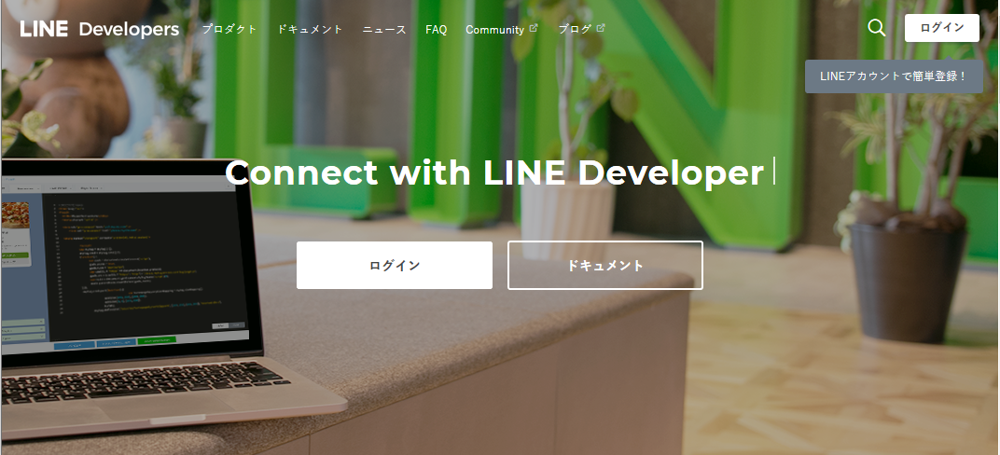

---

#### 準備.LINE Developersの登録.2　

- LINEアカウントでログイン
- 必要事項を入力して先に進める

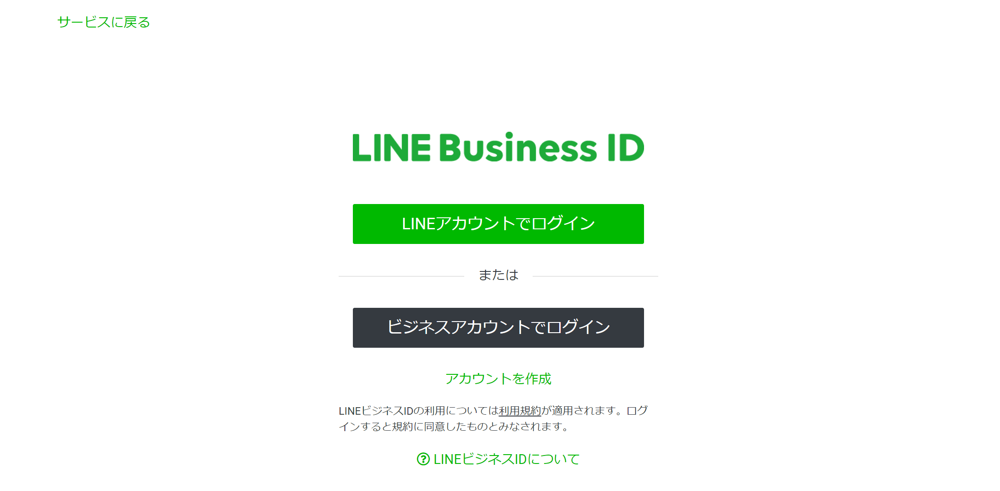

---

#### 準備.LINE Developersの登録.3　

- この画面まで進める

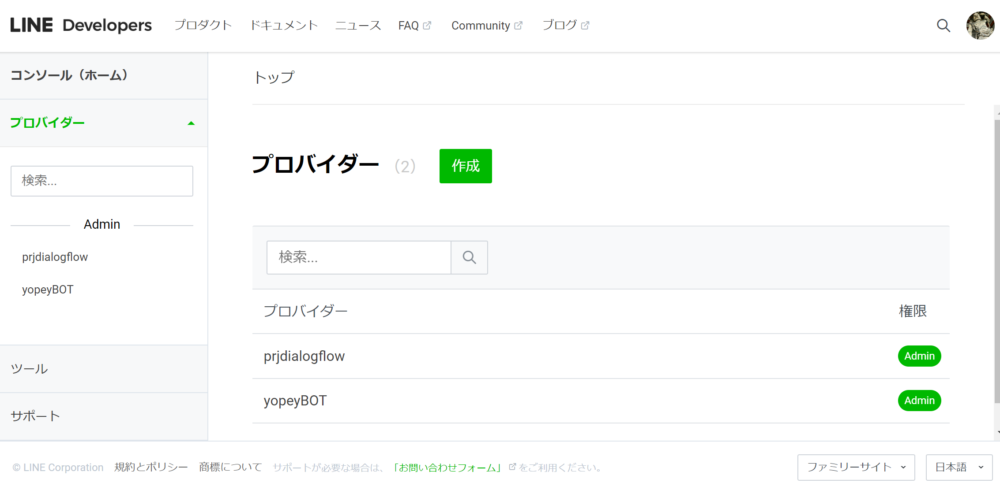

---

#### 準備.開発環境　

- Nodejs 12.0.0
  - (最新だとLineライブラリが動かないので今回はこのバージョン)
- 今回使用する主なライブラリ
  - @line/bot-sdk
  - express
  - ngrok
  - now

---

#### 準備.開発環境(Windows編)　

- Nodejsのバージョン管理のためにnodistをインストール

```
npm i -g nodist
```

```
// インストール可能なNode.jsのバージョン確認
nodist dist
```

```
// 指定バージョンをインストール
nodist 12.0.0
```

---

### 1.画像を返すChatBotの作成 

- LINE Developerの設定
- expressでWebアプリを作成
- ngrokで動作確認
- ZEITへデプロイ

---

#### LINE Developerの設定 

1. プロバイダー作成
1. チャンネル作成
1. チャンネルの設定
1. Message APIの設定
1. LINEアプリに追加

---

#### LINE Developer.プロバイダー作成 

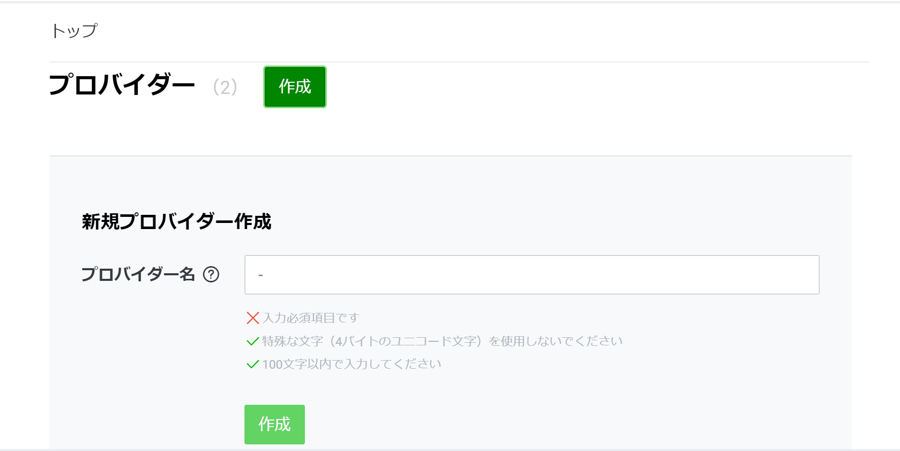

---

#### LINE Developer.チャンネル作成 

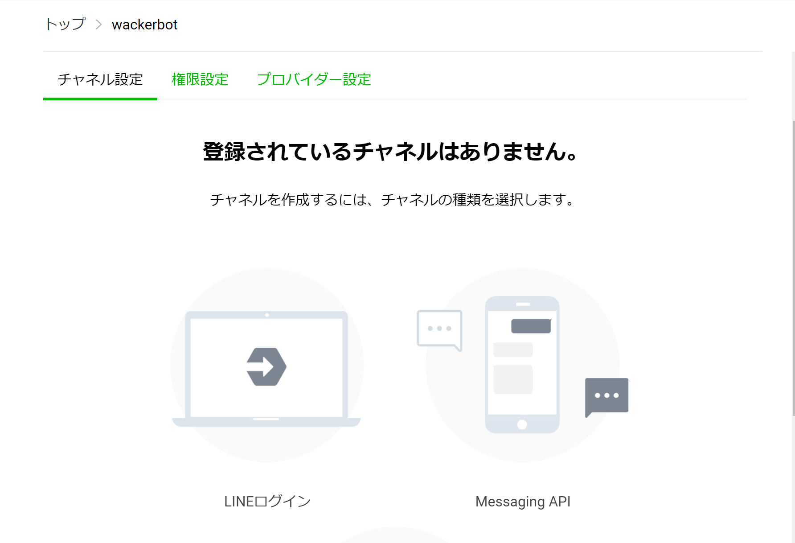

---

#### LINE Developer.チャンネル作成 

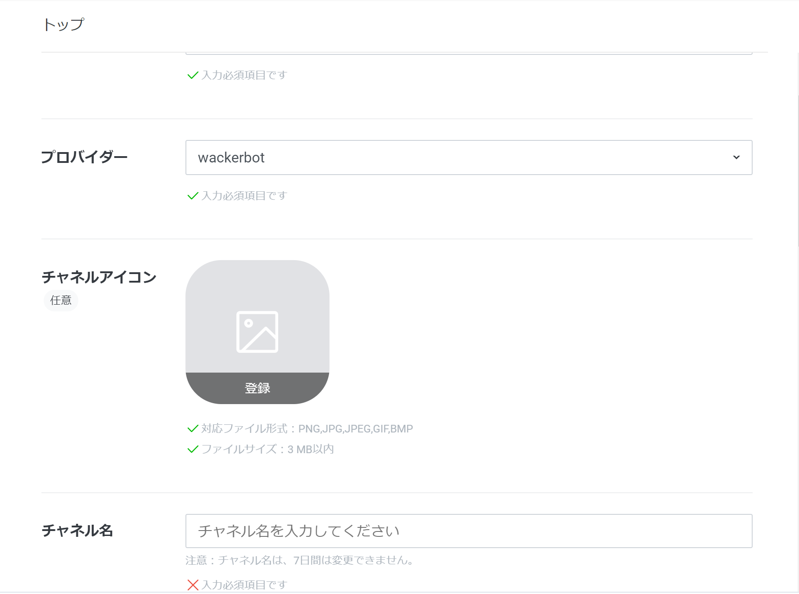

---

#### LINE Developer.チャンネル作成 

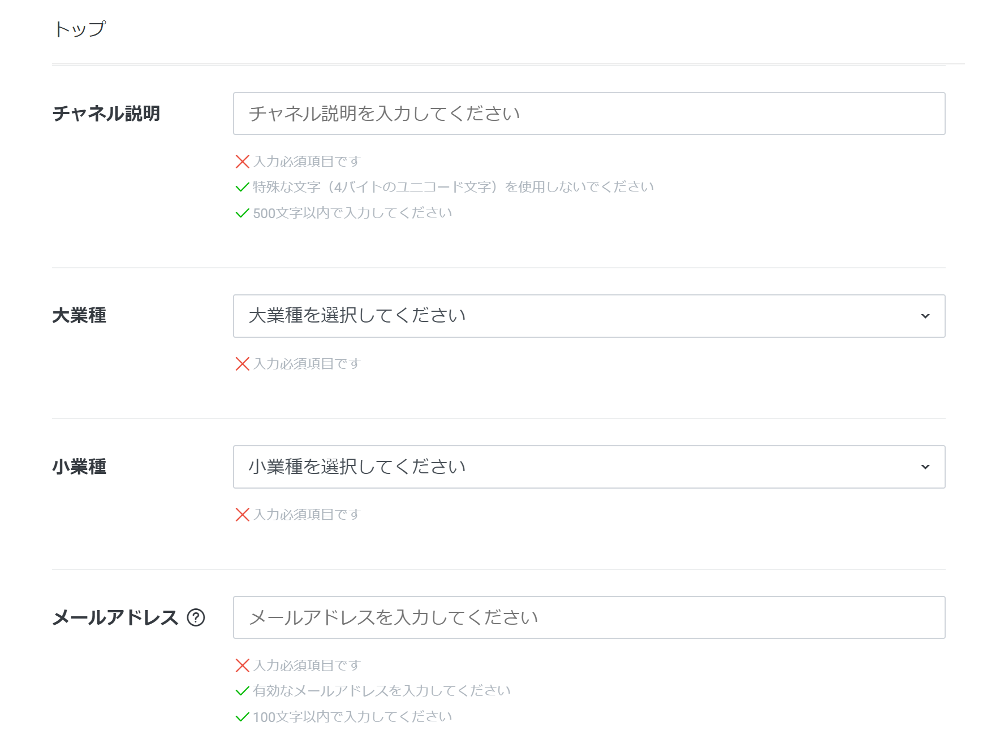

---

#### LINE Developer.チャンネル作成 

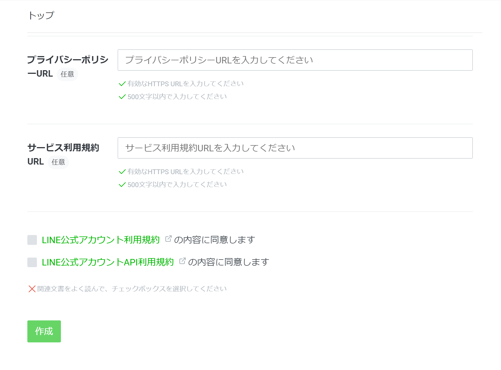

---

#### LINE Developer.チャンネルの設定 

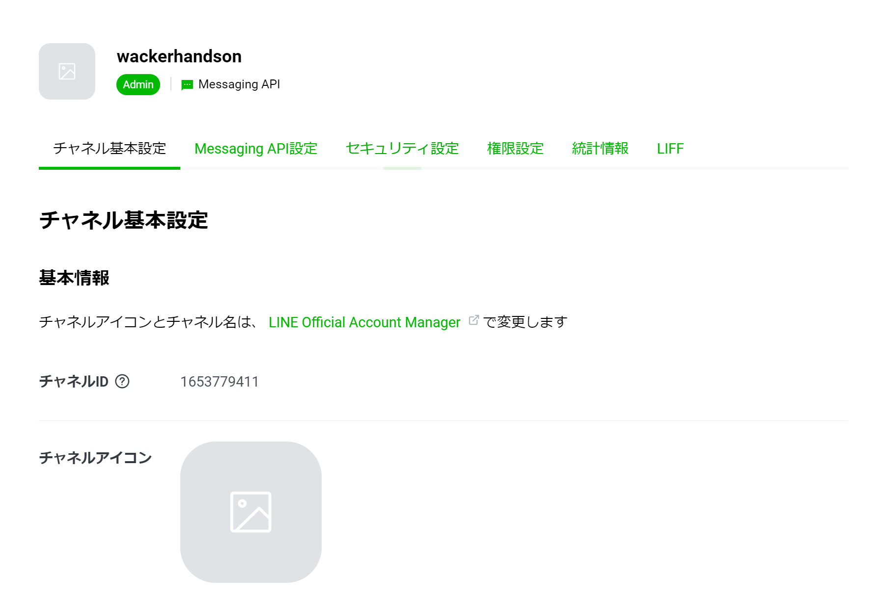

---

#### LINE Developer.Message APIの設定 

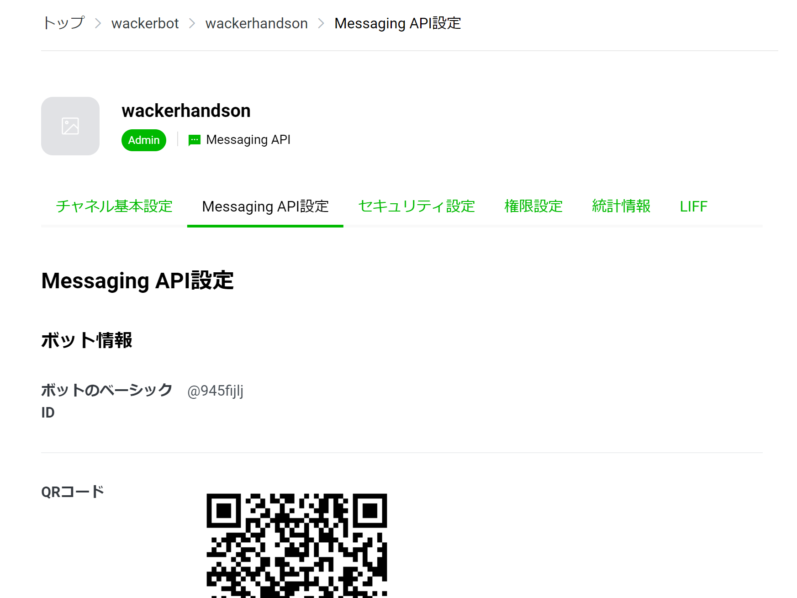

---

#### LINE Developer.Message APIの設定 

- Webhook URL = いまは未設定で次へ

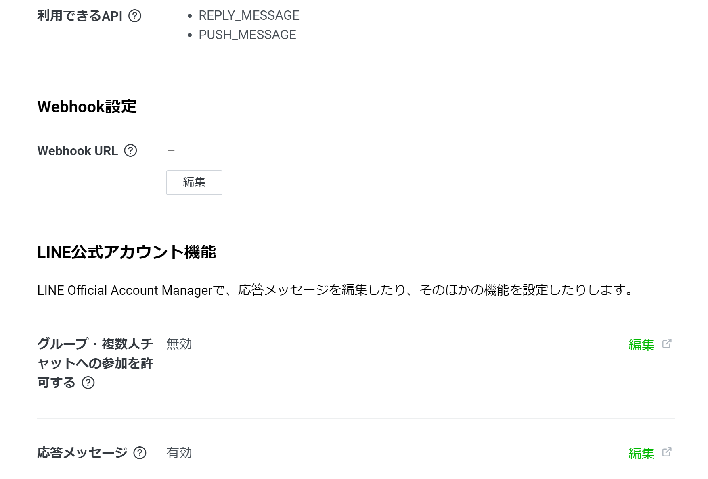

---

#### LINE Developer.Message APIの設定 

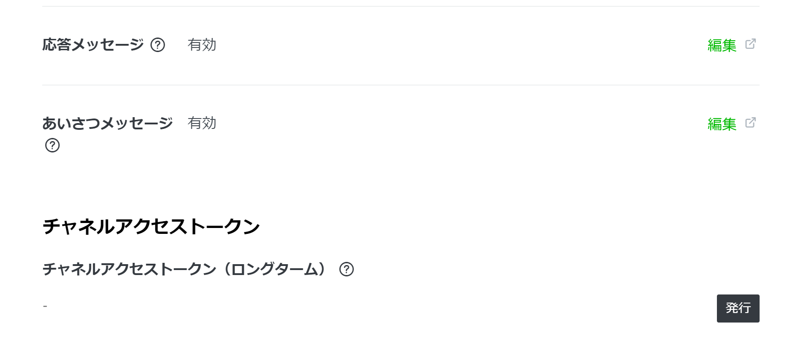

---

#### LINE Developer.Message APIの設定 

- 以下、デフォルトで進める
  - グループ・複数人チャットへの参加を許可する = 無効
  - 応答メッセージ　= 無効
    - 編集→基本設定
      - 応答モード=BOT
      - あいさつメッセージ=オン
    - 編集→詳細設定
      - 応答メッセージ＝オフ
      - Webhook＝オン
  - あいさつメッセージ　= 有効

---

#### LINE Developer.LINEアプリに追加 

- LINEアプリでQRコードを読込んで追加する


---

### ExpressでWebアプリを作成 

- Webアプリ作成
- ngrokの起動→アクセス確認
- LINE DeveloperにWebhookを設定
- LINEから話掛けて動作確認

---

### unsplashのアカウント作成

- [unsplash](https://unsplash.com/developers)のアカウント作成
- アカウントページからAPI/Developers→Appの作成しKeyを取得

---

#### ライブラリをインストール 

- 以下をインストール（npm i -g　xxx）
  - express
  - ngrok
  - now

---

#### Webアプリ作成 

- Githubからソースをクローン or ダウンロード
  - git@github.com:yoheitaniguchi/wacker46.git
- 環境変数用の「.env」ファイルを作成する。(詳細は次ページで説明)
- npm install を実行
  - installされるモジュールはpackage.jsonを確認
- npm startを実行
- http://localhost:3000　へアクセス

---

#### Webアプリ作成 

「.env」ファイルに以下を記述
- CHANNEL_SECRET= *YOUR KEY*
  - LINE Developer → チャンネル設定 → チャネルシークレット
- CHANNEL_ACCESS_TOKEN= *YOUR KEY*
  - LINE Developer → Messaging API設定 → チャネルアクセストークン
- UNSPLASHCLIENT_ID= *YOUR KEY*
  - Unsplash Developers → アプリの画面 → Access Key

---

#### ngrokを起動させてアクセス 

```
ngrok http 3000
```

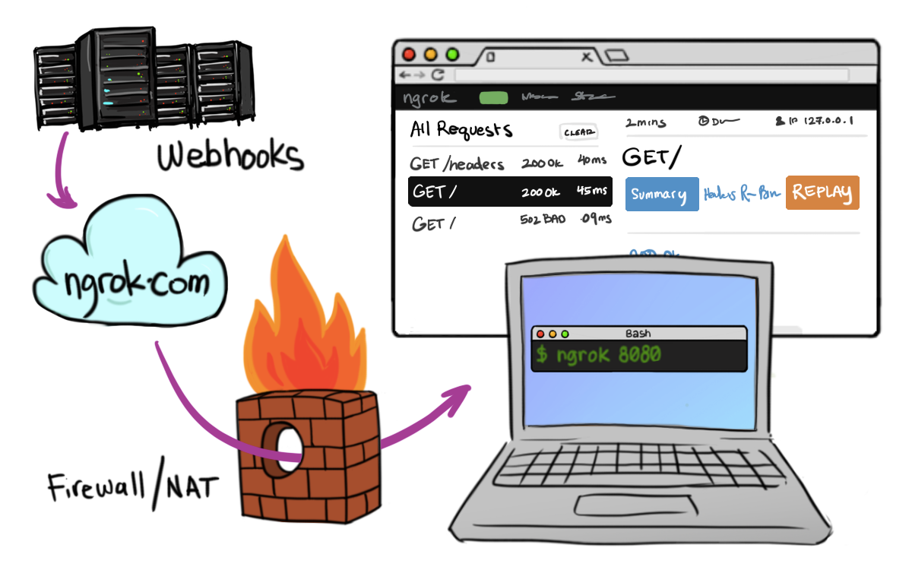

---

### #ngrokを起動させてアクセス 

- 生成されたURLを使ってインターネットからローカルにアクセスが可能となる。

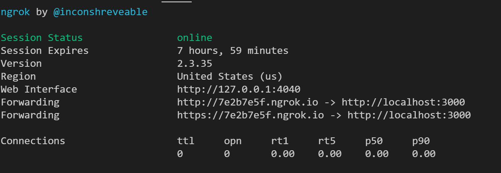

---

#### ngrokを起動させてアクセス 

- 生成されたURLをLineチャンネルのwebhookの設定に入力する。
  - 例：https://xxxxx.ngrok.io/webhook
    - URLの後ろに上記例のように「/webhook」を追加  
  - 検証を押下して確認
  - 「Webhookの利用」ボタンをオンにする。


---

#### LINEからメッセージを送ってみる

---

### ZEITへデプロイ

- ZEITへデプロイを実行
  - 環境変数設定(次ページで説明)
- ZEITのダッシュボードでデプロイ結果を確認
- ZEIT上で生成されたURLにアクセス
- LINE DeveloperにWebhookのURLを変更

---

### ZEITへデプロイ.環境変数設定

- 以下コマンドで各KEYをZEITの環境変数に設定
  - now secrets add 変数名 KEY
- 例：
  - now secrets add channel_secret *YOUR KEY*
  - now secrets add channel_access_token *YOUR KEY*
  - now secrets add unsplashclient_id *YOUR KEY*

- 間違ったら「now secrets remove 変数名」で削除＆再登録

---

### ZEITへデプロイ

```
// now コマンドを実行
$ now
```

```
// 認証用のメールを入力
> No existing credentials found. Please log in:
> Enter your email:
```
- 指定したメールアドレスに認証用メールが届くので認証する。
  - 「verify」ボタンを押下するかその下のURLをクリック

---

### ZEITへデプロイ

- 以下のようなログが流れる

```
> UPDATE AVAILABLE Run `npm i -g now@latest` to install Now CLI 16.7.3
> Changelog: https://github.com/zeit/now/releases/tag/now@16.7.3
> Deploying C:\xxxxx
> Using project xxxx
> Synced 1 file [430ms]
> NOTE: Deployed to production. Run `now --prod` to overwrite later (https://zeit.ink/2F).
> https://xxxxx.now.sh [2s]
> Ready! Deployment complete [14s]
- https://xxxxx.now.sh
- https://xxxx.now.sh [in clipboard]
```

---

### ZEITへデプロイ

- ZEITのURLをLINE Developerのwebhookの設定に入力し、動作確認を行う

---

### テーマ3.他のREST APIを使ってスキルを追加する

- 天気予報
  - https://openweathermap.org/api
- 地図検索
  - https://nominatim.org/release-docs/latest/api/Overview/
  - 例：https://nominatim.openstreetmap.org/search.php?q=wakayama&format=json
- 図書館本検索
  - https://calil.jp/doc/api.html
- 番組検索
  - http://api-portal.nhk.or.jp/doc_list-v1_con

---

### 参考サイト

-  [1時間でLINE BOTを作るハンズオン (資料+レポート) in Node学園祭2017 #nodefest](https://qiita.com/n0bisuke/items/ceaa09ef8898bee8369d)

- [Serverless Deployment サイト：ZEIT(旧NOW.sh)](https://zeit.co/)
- [LINE APIドキュメント](https://developers.line.biz/ja/docs/)

